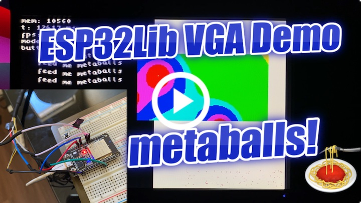

# ESP32VGADemo
A small VGA demo for ESP32 powered by [bitluni's ESP32Lib](https://github.com/bitluni/ESP32Lib).

## Features
1. Metaballs with configurable color ramp
2. Sinusoidal wavy text
3. Bouncing ball simulation with gravity
4. Push button to switch between the different demos

## Photos and videos

      
